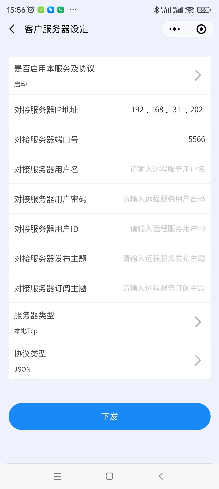
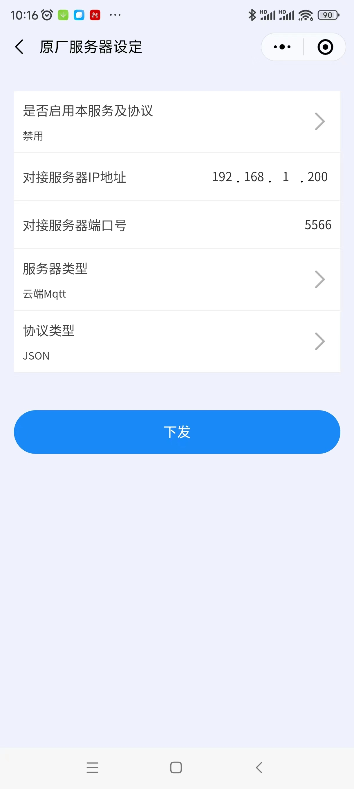

# 代码说明

|  版本   | 日期  | 作者  | 修改记录  |
|  ----   | ----  | ----  | ----  |
| V0.1  | 2023.04.28 | 纪灿萌 | 初版 |

本文档用于描述用于和A01智能网关通信的服务器端示例程序的基本使用方法。

A01是青岛飞奕科技的智能网关产品，提供网络接口和外部程序通信。

有一种场景是：有一台服务器，同时连接了多个A01智能网关产品。服务器作为tcp server，A01作为tcp client。它们之间交互的数据是json格式的数据。

本代码库就是如上场景中tcp server侧的示例代码，服务器侧是linux操作系统。本代码的示例程序只是实现了简单的写命令和读取命令，并未实现全部的协议解析。代码经过初步测试，正常可用。

正常测试步骤如下：

1. 配置智能主机A01
    1.1 A01上电，使用网线连接到WAN口。
    1.2 通过A01上面的按键操作，可以看到固件版本信息。
    1.3 通过A01上面的按键操作，确认蓝牙打开。并且可以看到蓝牙标识。
    1.4 使用微信小程序”网关配置”，可以搜索到对应的蓝牙设备，并进行连接。
    1.5 连接后，通过“设备配置”中的“WAN设定”，可以看到智能主机的ip地址。然后针对“客户服务器设定”，配置如下：

    - 主要配置5项：
        1. 是否启动本服务及协议：启动
        2. 对接服务器IP地址：    x.x.x.x（下图中设定是192.168.31.202）
        3. 对接服务器端口号：    x（下图中设定是5566）
        4. 服务器类型：         本地Tcp
        5. 协议类型：           JSON

    - 注意，同时还要设置“原厂服务器设定”，将“是否启用本服务及协议”设置为“禁用”。如下图（因为当前这两个是冲突的，后续会解决）：

2. 在服务器端编译并运行示例程序
    2.1 下载代码到linux操作系统
    2.2 执行 make 命令，会在 output 目录下生成 example 可执行文件
    2.3 执行 ./output/example 程序

3. 代码当前存在的缺陷
    3.1 修改了头文件后，在执行 make 命令时并不会重新编译依赖于这个头文件的源文件，临时的解决方法是每次都执行 make clean 再执行 make.

